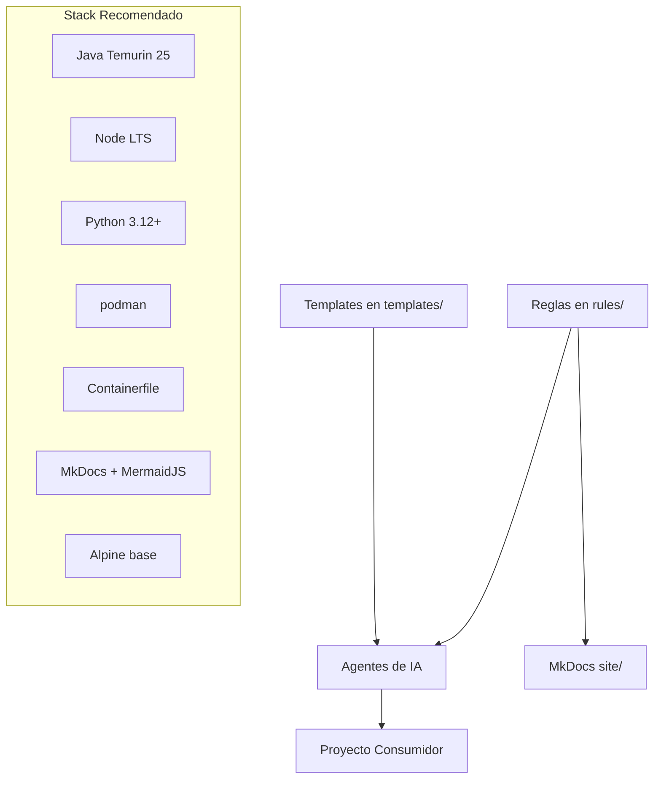

# Documentación Principal

Bienvenido a la documentación de Ether My Best Practice.

## Contenidos

- [Guía de Inicio Rápido](getting-started.md)
- [Contribuyendo](contributing.md)
- [Descargar el MCP](mcp.md)
- [Índice de Reglas](rules/00-index.md)

## Resumen

Ether My Best Practice es una plantilla de buenas prácticas orientada a proyectos de API REST donde las reglas deben poder ser consumidas por agentes de IA y reutilizadas como contexto operativo:

- 🏗️ Arquitectura hexagonal
- 📝 Documentación como código (Markdown + MermaidJS + MkDocs)
- ✅ Testing y TDD
- 🔄 Git Flow y Conventional Commits
- 🚀 CI/CD automatizado con podman/Containerfile
- 🛠️ Stack tecnológico predefinido para consistencia
- 🤖 Integración con agentes de IA (MCP)

### Arquitectura del estándar

## Enfoque

Este repositorio combina dos piezas:

- Reglas versionadas en [../rules/00-index.md](rules/00-index.md) para decirle a humanos y agentes cómo trabajar.
- Plantillas en [../templates/](../templates/) para que un agente pueda generar el cascarón inicial de una API REST coherente con esas reglas.

La combinación permite que un MCP o un agente local no solo lea normas, sino que también tenga una base estructural para crear archivos y carpetas siguiendo el estándar.

## Para Empezar

1. Lee [Getting Started](getting-started.md)
2. Consulta las [Reglas](rules/00-index.md)
3. Usa las [Plantillas](../templates/)
