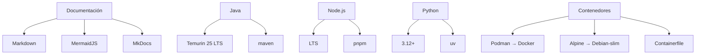

# Regla 08: Stack Tecnológico Recomendado

## Premisa

Todo proyecto generado con este estándar debe usar un stack tecnológico predefinido para eliminar ambigüedad de versiones, herramientas y runtimes. Esto garantiza que los agentes de IA generen proyectos consistentes y que los builds sean reproducibles en cualquier entorno.

## Estructura

### Matriz del stack recomendado

| Componente | Recomendado | Fallback / Alternativa | Nota |
|---|---|---|---|
| **Documentación** | Markdown + MermaidJS | — | Diagramas como código, versionables en Git |
| **Sitio** | MkDocs (con MkDocs Material) | — | `mkdocs build` + GitHub Pages |
| **Java** | Temurin 25 LTS (JDK) | — | Build tool: `maven` o `gradle` |
| **Node.js** | Última versión LTS | — | Gestores: `npm`, `pnpm` (preferido) |
| **Python** | 3.12 o superior | — | Gestor de dependencias: `uv` (preferido), `poetry` |
| **Runtime de contenedores** | Podman | Docker (con **warning**) | Detección automática; sobreescribible con `CONTAINER_RUNTIME` |
| **Imagen base** | Alpine (latest estable) | Debian-slim (si Alpine no es viable) | Imágenes etiquetadas por hash, no por `:latest` |
| **Definición de imagen** | `Containerfile` (o `Containerfile.ci`) | — | **Nunca `Dockerfile`**. `podman build -f Containerfile` / `docker build -f Containerfile` |

### Herramientas de soporte

```
helpers/shell/container.sh   →  resuelve podman > docker, construye con Containerfile
helpers/mk/container.mk      →  targets runtime, image, ci
helpers/shell/java.sh        →  build/test/serve con Java
helpers/shell/javascript.sh  →  build/test/serve con Node
helpers/shell/python.sh      →  build/test/serve con Python
helpers/shell/rust.sh        →  build/test/serve con Rust
helpers/shell/docs.sh        →  docs build/serve
helpers/shell/lint.sh        →  lint multi-lenguaje
helpers/shell/format.sh      →  format multi-lenguaje
```

## Nombres Sugeridos

- `Containerfile` o `Containerfile.ci` para imágenes de CI (nunca `Dockerfile`).
- Imágenes base: `alpine:3.20`, `debian:bookworm-slim` (con hash).
- Variables de entorno: `CONTAINER_RUNTIME` (podman|docker), `CI_IMAGE`, `CI_CONTAINERFILE`.
- Java: `JAVA_HOME` apuntando a Temurin (gestor de JDK: `sdkman` o instalación directa).
- Python: entorno gestionado con `uv` + `pyproject.toml`.
- Node: `.nvmrc` para fijar la versión LTS.

## Comandos

### Verificación del toolchain

```bash
java -version          # Temurin 25 LTS
node --version         # LTS
python3 --version      # 3.12+
podman --version       # O docker --version
```

### Build de imagen con Containerfile

```bash
podman build -f Containerfile.ci -t mi-proyecto-ci:local .
make image                     # Delegación vía container.mk
```

### CI local con el stack

```bash
make image LANG=java BUILD_TOOL=maven
make ci    LANG=java BUILD_TOOL=maven
```

### Si solo hay Docker (warning)

```bash
make runtime                   # Detecta docker
make image                     # docker build -f Containerfile.ci ...
```

El helper `container.sh` emite un warning: `Docker detectado. Podman es la opción recomendada.`

## Ejemplos

### Diagrama de arquitectura del stack (MermaidJS)



### `Containerfile` base Alpine multi-stage

```dockerfile
# Containerfile.ci — imagen de CI con toolchain multi-lenguaje
FROM alpine:3.20@sha256:...

RUN apk add --no-cache bash curl git

# Java (Temurin)
# RUN apk add --no-cache openjdk25

# Node.js LTS
# RUN apk add --no-cache nodejs npm

# Python 3.12+
# RUN apk add --no-cache python3 py3-pip

WORKDIR /workspace
ENTRYPOINT ["/bin/bash", "-lc"]
```

### `make runtime` con detección + warning

```text
$ make runtime
Container runtime: podman

$ make runtime CONTAINER_RUNTIME=docker
WARNING: Docker detectado. Podman es la opción recomendada según la regla 08-stack.
Container runtime: docker
```

## Restricciones

- **No usar `Dockerfile` como nombre de archivo.** Usar `Containerfile` o `Containerfile.ci`.
- **No usar Docker si podman está disponible** — el helper de contenedores lo detecta automáticamente y emite un warning si elige Docker.
- **No usar imágenes base sin etiquetar** (`:latest`). Fijar versión y preferir Alpine; si no, Debian-slim.
- **No usar versiones no-LTS de Java.** Siempre Temurin LTS.
- **No usar versiones non-LTS de Node.js** en proyectos de API REST.
- **No documentar con formatos no versionables** (Google Docs, wikis externas, Confluence). Los diagramas deben ser MermaidJS embebidos en Markdown.
- **No mezclar sistemas de construcción de documentación** — MkDocs es el estándar único.
- **No usar Python < 3.12** en nuevos proyectos consumidores.

## Referencias

- [Regla 01: Build Tooling](01-build-tooling.md) — helpers por lenguaje, `container.mk`, `container.sh`
- [Regla 04: Documentación](04-documentation.md) — Markdown + MermaidJS + MkDocs
- [Regla 06: CI](06-ci.md) — pipeline local en contenedor, `make image`, `make ci`
- [templates/Containerfile.tmpl](../templates/repository-structure/containers/Containerfile.tmpl)
- [templates/helpers/mk/container.mk.tmpl](../templates/repository-structure/helpers/mk/container.mk.tmpl)
- [templates/helpers/shell/container.sh.tmpl](../templates/repository-structure/helpers/shell/container.sh.tmpl)
- [Adoptium Temurin](https://adoptium.net/)
- [Podman](https://podman.io/)
- [MermaidJS](https://mermaid.js.org/)

## Plantilla

- [templates/Containerfile.tmpl](../templates/repository-structure/containers/Containerfile.tmpl)
- [templates/helpers/mk/container.mk.tmpl](../templates/repository-structure/helpers/mk/container.mk.tmpl)
- [templates/helpers/shell/container.sh.tmpl](../templates/repository-structure/helpers/shell/container.sh.tmpl)
